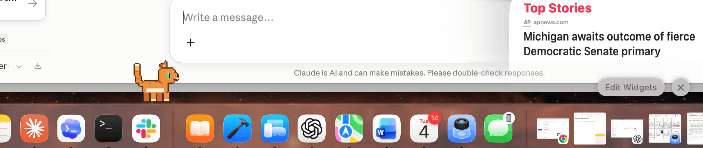
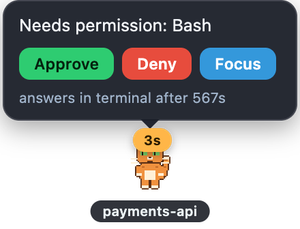
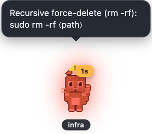
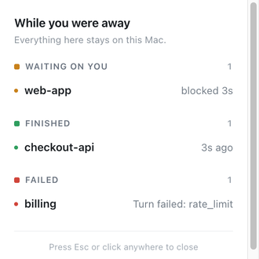
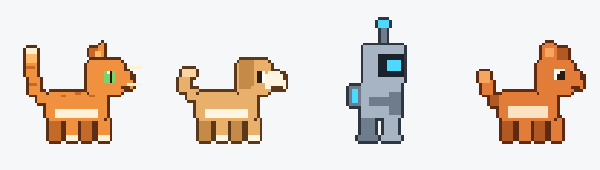
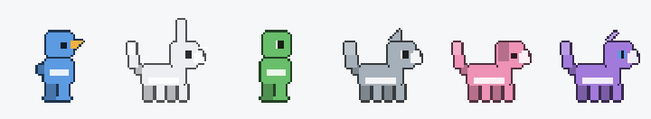
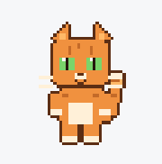
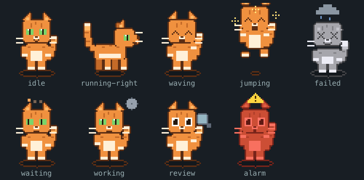

<p align="center">
  
</p>

<h1 align="center">🐾 desktop-pets</h1>

<p align="center">
  <b>A pixel pet that lives on your Dock and watches your coding agents.</b><br>
  It decides whether to interrupt you, and lets you answer back.
</p>

<p align="center">
  <a href="https://github.com/Pieismath/desktop-pets/actions/workflows/ci.yml"></a>
  
  
  
  
</p>

<p align="center">
  <a href="#get-it-running">Install</a> ·
  <a href="#what-it-actually-does">Features</a> ·
  <a href="#pick-a-pet-or-invent-one">Pets</a> ·
  <a href="CONTRIBUTING.md">Contribute</a>
</p>

---

## Get it running

Three commands, about two minutes.

```sh
git clone https://github.com/Pieismath/desktop-pets.git
cd desktop-pets
pnpm install && pnpm start
```

A cat appears on your Dock and starts wandering. Quit any time from the 🐾 icon
in your menu bar.

Then, to let it watch Claude Code:

```sh
node packages/hooks/dist/installer.js install   # backs up settings.json first
```

<details>
<summary><b>Requirements</b>: macOS, Node 22+, pnpm</summary>

- macOS (tested on Apple Silicon, macOS 26)
- [Node.js](https://nodejs.org) 22 or newer
- [pnpm](https://pnpm.io/installation) (`npm install -g pnpm`)
- [Claude Code](https://claude.com/claude-code) is optional. The pet is happy
  on its own; the agent features need it.

</details>

---

## What it actually does

Most agent status tools tell you the same thing the same way, no matter what
you're doing. This one is built around three ideas that go further.

### 🔔 It answers permission prompts for you



When Claude Code is blocked waiting on permission and you're in another app,
the pet shows the request with **Approve / Deny / Focus** and a countdown.

Click Approve and the tool runs. Focus your terminal instead and the pet steps
aside so the normal prompt takes over. **The pet answers when you're
elsewhere; the terminal answers when you're looking at it.**

Running several agents? Each session gets **its own pet, tagged with its
project**, so "which one is stuck?" is answered at a glance.

<br clear="all">

### ⚠️ It flags risk, not just activity



Anything can show that an agent is *busy*. This goes loud when an agent is
about to do something you'd want to see: `rm -rf`, `git push --force`, writes
to `.env` or prod config, `sudo`, `DROP TABLE`, `kubectl delete`.

The rules live in **one file you can read and edit**, tuned hard for
precision: `rm -rf node_modules` stays silent, `echo "rm -rf /"` stays silent,
`sudo rm -rf /var/data` does not. A false alarm would train you to ignore it,
so ordinary commands are tested as carefully as dangerous ones.

<br clear="all">

### 🚶 It escalates based on where you are

| Where you are | What happens |
|---|---|
| The agent's own terminal is focused | silent animation |
| You're in another app | speech bubble |
| Idle more than 2 minutes | real macOS notification |
| Idle more than 10 minutes | notification, kept for the digest |
| Screen-sharing or in a call | everything below `alarm` goes quiet |

Click the pet any time for a plain summary of what happened while you were
away. Otherwise it stays out of the way, strolling along the Dock and settling
again.

<p align="center">
  
</p>

---

## Pick a pet, or invent one

Four pets ship with it: a cat, a dog, a robot and a fox. All original pixel
art, drawn in code, CC0.

<p align="center">
  
</p>

<p align="center"><sub>
<b>Mochi</b> (cat, default) · <b>Biscuit</b> (dog) · <b>Bolt</b> (robot) · <b>Ember</b> (fox)
</sub></p>

Switch between them from **🐾 → Character**. The change is instant, and the menu
shows each pet's licence and author right where you pick it.

### Describe a pet and it draws it

Don't like any of them? Say what you want:

```sh
node packages/create-pet/dist/bin.js from-prompt "a purple dragon with horns" \
  --license CC0-1.0 --author "Your Name" --install
```

<p align="center">
  
</p>

<p align="center"><sub>
“a blue penguin” · “a fluffy white bunny” · “a green frog” · “a grey wolf” · “a pink pig” · “a purple dragon”
</sub></p>

**This runs entirely on your machine.** No API key, no account, no network
call, nothing to pay for: it's a parametric pixel-art generator, not an image
model. It knows ~26 species, ~30 colours and phrases like `floppy ears`,
`long tail`, `green eyes`, `boxy`. Anything it doesn't recognise is filled in
from a hash of your words, so the same description always gives the same pet.

`--install` drops it straight into your pets folder, so it appears in the
Character menu with no restart.

<details>
<summary><b>Already have art?</b> Use a picture or a spritesheet instead</summary>

```sh
# any image: a drawing, a photo, or art you generated yourself
node packages/create-pet/dist/bin.js from-image my-character.png \
  --id my-pet --name "My Pet" --license CC0-1.0 --author "You" --install

# a ready-made 8x10 grid of 192x208 frames
node packages/create-pet/dist/bin.js from-sheet my-sheet.webp --id my-pet ...

# check any pet folder
node packages/create-pet/dist/bin.js validate ./my-pet
```

Your image is reduced to pixels and run through the same animation engine as
the bundled pets, so it picks up the walk, the grey "failed" wash and the red
"alarm" flash automatically.

</details>

> **Every pet must declare `license` and `author`.** There's no flag to skip
> it: a pet without them fails validation and never reaches the picker. And no
> copyrighted characters, ever: no Mario, no Pokémon. Original or public-domain
> art only. [CONTRIBUTING.md](CONTRIBUTING.md) lists good CC0 sources.

### Ten states, one sheet

<p align="center">
  
</p>

<p align="center">
  
</p>

---

## Status: what this is, and isn't

- **macOS only.** Tested on Apple Silicon.
- **Runs from source.** There's no signed `.app` yet. You clone it and run it
  with `pnpm`. If you want a double-clickable app, that work isn't done.
- **Local only.** No telemetry, no analytics, no network calls of any kind. The
  pet talks to agents over a Unix socket with a per-run random token, and
  nothing an agent says is shown raw. It all passes through one sanitiser that
  strips paths, URLs, tokens and secrets first.
- **Claude Code** is the fully-wired integration. Anything that speaks **MCP**
  can drive the pet too (`pet_status`, `pet_react`, `pet_say`).
- Treat it as **beta**: 222 tests and green CI, but it hasn't lived through
  months of daily use. [`DECISIONS.md`](DECISIONS.md) records every design call
  and its rationale, including what I couldn't verify.

---

## Everyday bits

<details>
<summary><b>Where your files live</b></summary>

Everything sits under `~/Library/Application Support/desktop-pets/`:

| File | What it's for |
|---|---|
| `pets/` | Your installed characters (one folder each) |
| `config.json` | Escalation timings, Do Not Disturb apps, reaction→sprite overrides |
| `risk-rules.json` | The alarm rules: the one file to audit or edit. Applies live |
| `history.jsonl` | Bounded local log behind the digest (≤300 entries / 7 days) |
| `state.json` | Chosen character, pet positions, DND toggle |

Delete that folder to reset everything.

</details>

<details>
<summary><b>Uninstall</b></summary>

```sh
node packages/hooks/dist/installer.js uninstall      # unhook Claude Code
rm -rf ~/Library/Application\ Support/desktop-pets   # settings and pets
```

Then delete the cloned repo. Nothing is written anywhere else.

</details>

<details>
<summary><b>Troubleshooting</b></summary>

**Notifications never appear.** macOS asks once. If you missed it:
System Settings → Notifications → Electron.

**The pet doesn't sit on the Dock.** It stands on the Dock's top edge, worked
out from your screen's usable area. With the Dock auto-hidden there's no ledge,
so it stands on the bottom of the screen instead. Drag it anywhere. It stays
where you put it.

**`pnpm install` prints an Electron error.** Check whether it actually failed:
`pnpm --filter @desktop-pets/host exec electron --version`. If that prints a
version, ignore the warning; otherwise `pnpm rebuild -r electron`.

**It doesn't react to Claude Code.** Confirm hooks are installed
(`node packages/hooks/dist/installer.js status`) and restart Claude Code, because
hooks are read at startup. `DESKTOP_PETS_DEBUG=1` makes the hook explain itself.

**Too big / too small.** The pet renders about 62 pt tall. Change `PET_SCALE`
in `packages/shared/src/viewmodel.ts`; the window follows automatically. On a
Retina display any multiple of `0.125` stays pixel-crisp (`0.25`, `0.375`. The
default: `0.5`, `0.75`, `1.0`).

</details>

<details>
<summary><b>How it's built</b></summary>

| Path | What it is |
|------|------------|
| `apps/host` | The Electron app: pet windows, IPC, escalation, alarms, digest |
| `packages/shared` | Sprite/pet formats, reactions, the sanitiser, risk rules, protocol |
| `packages/client` | Small library that talks to the host socket |
| `packages/hooks` | Claude Code hook runner + settings installer/uninstaller |
| `packages/mcp` | MCP server exposing `pet_status`, `pet_react`, `pet_say` |
| `packages/create-pet` | The pixel-art engine and the `create-pet` CLI |
| `pets/` | The bundled characters |

**Sprite format.** One `.webp`, 8 columns × 10 rows, 192×208 per frame, one row
per state: `idle, running-right, running-left, waving, jumping, failed,
waiting, working, review, alarm`.

**Agents never name sprite rows.** They emit *reactions*, `thinking, working,
editing, running, testing, waiting, success, error, celebrating, risky`, and
the host maps those to sprite states through a table you can override. New
reactions never need new art.

```sh
pnpm test    # typecheck + 222 unit tests
pnpm lint
pnpm smoke   # launch, screenshot all 10 states, exit
```

</details>

---

## Contributing

Pets especially welcome: [CONTRIBUTING.md](CONTRIBUTING.md) has three routes to
one, the two provenance rules, and where to find CC0 art.

## Licence

MIT for the code. Bundled art is CC0-1.0. Each pet declares its own licence in
its `pet.json`.
