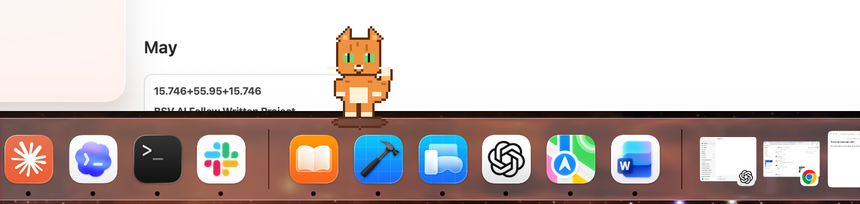
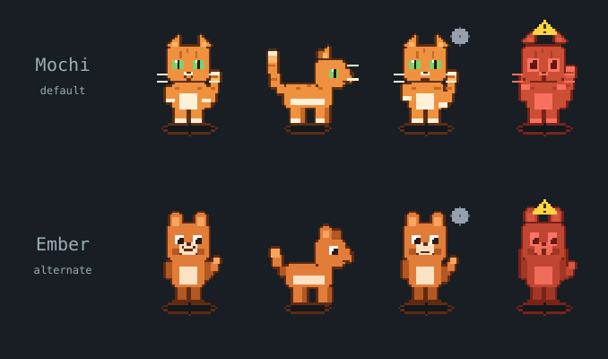
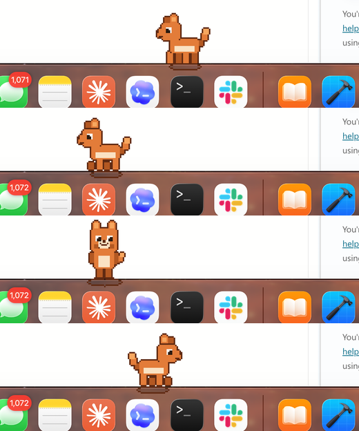

# 🐾 desktop-pets

A pixel companion that sits on your macOS Dock and watches your coding agents.
Unlike a status light, it **decides whether to interrupt you — and lets you
answer back.**



---

## What it actually does

### 1. It answers permission prompts for you

When Claude Code is blocked waiting for permission and you're in another app,
the pet shows the request with **Approve / Deny / Focus** buttons and a
countdown. Click Approve and the tool runs. Focus your terminal instead and
the pet steps aside so the normal prompt takes over — the pet answers when
you're elsewhere, the terminal answers when you're looking at it.


With several agents running, each session gets **its own pet, tagged with its
project**, so "which one is stuck, and unstick it from here" works at a glance.

### 2. It flags risk, not just activity

Most tools show that an agent is *busy*. This one goes loud when an agent is
about to do something you'd want to see: `rm -rf`, `git push --force`, writes
to `.env` or prod config, `sudo`, `DROP TABLE`, `kubectl delete`.


Rules live in **one editable file** you can audit, and are biased hard toward
precision — `rm -rf node_modules` stays silent, `echo "rm -rf /"` stays
silent, `sudo rm -rf /var/data` does not. A false alarm would kill the
feature, so ordinary commands are tested as carefully as dangerous ones.

### 3. It escalates based on where you are

The same event reaches you differently depending on what you're doing:

| Where you are | What happens |
|---|---|
| The agent's own terminal is focused | silent animation |
| You're in another app | speech bubble |
| Idle more than 2 minutes | real macOS notification |
| Idle more than 10 minutes | notification, and it's kept for the digest |
| Screen-sharing or in a call | everything below `alarm` stays quiet |

Click the pet any time for **"while you were away"** — what finished, what's
blocked and for how long, what failed. All local.


---

## Status, and what this is not

- **macOS only** (developed and tested on Apple Silicon, macOS 26).
- **Runs from source.** There's no signed `.app` bundle yet — you clone it and
  run it with `pnpm`. If you want a double-clickable app, that work isn't done.
- **Claude Code** is the fully-wired integration. Anything that speaks **MCP**
  can drive the pet too, via three tools (`pet_status`, `pet_react`, `pet_say`).
- **Local only.** No telemetry, no analytics, no network calls of any kind.
  The pet talks to agents over a Unix socket with a per-run random token.
- Treat it as **beta**. It's well tested (202 unit tests, CI green) and has
  been driven end-to-end against the real hook contract, but it hasn't lived
  through months of daily use. `DECISIONS.md` documents every judgment call,
  including the one path I couldn't verify on my machine.

---

## Requirements

- macOS
- [Node.js](https://nodejs.org) 22 or newer
- [pnpm](https://pnpm.io/installation) 10 or newer — `npm install -g pnpm`
- [Claude Code](https://claude.com/claude-code) (optional, for the agent
  features — the pet runs happily on its own)

## Install and run

```sh
git clone https://github.com/Pieismath/desktop-pets.git
cd desktop-pets
pnpm install
pnpm start
```

A cat appears on your Dock. That's it — nothing else is required to watch it
wander.

To quit, use the **🐾 icon in your menu bar → Quit**. (The app deliberately has
no Dock icon of its own.)

Useful extras:

```sh
pnpm test    # typecheck + 202 unit tests
pnpm smoke   # launch, screenshot all 10 states to captures/, exit
```

## Connect it to Claude Code

```sh
node packages/hooks/dist/installer.js install
```

This writes hook entries into `~/.claude/settings.json`, **backing the file up
first**. Start (or restart) Claude Code and the pet begins reacting: thinking
when you submit a prompt, working per tool call, a jump when a task finishes,
an alarm on a risky command, and Approve/Deny buttons when it's blocked.

To check or remove:

```sh
node packages/hooks/dist/installer.js status
node packages/hooks/dist/installer.js uninstall   # removes exactly what it wrote
```

Optionally expose the pet to any MCP client:

```sh
claude mcp add desktop-pets -- node "$PWD/packages/mcp/dist/bin.js"
```

---

## Characters

Two pets ship with the app. Both are original pixel art, drawn in code, CC0 —
they have no special status, they're just installed:



**To see and switch them: 🐾 menu bar → Character.** The list shows every
installed pet with its licence and author, switching is instant, and your
choice is remembered.

Every pet animates through the same ten states:


When it has nothing to tell you, it strolls a short way along the Dock every
few minutes and settles again — turning to face the way it's going. A pet
that's blocked, alarmed or mid-sentence stays put, so you never have to chase
it to click a button.



### Make your own

Hand-assembling 80 frames at exact dimensions is why pet libraries stay tiny,
so the CLI does it. Give it one drawing and it produces the whole sheet:

```sh
node packages/create-pet/dist/bin.js from-image my-character.png \
  --id my-pet --name "My Pet" --license CC0-1.0 --author "Your Name" --install
```

`--install` writes it straight to your pets folder, so it appears in the
Character menu immediately — no restart. Your image is reduced to pixels and
run through the same animation engine as the bundled characters, so it picks
up the walk, the grey "failed" wash and the red "alarm" flash automatically.

Already have art? `from-sheet` takes your own 8×10 grid, and `validate` checks
any pet folder.

> **Provenance is required.** Every pet must declare `license` and `author`.
> There's no flag to skip it — a pet without them fails validation and won't
> install. And no copyrighted characters, ever: no Mario, no Pokémon. Original
> or public-domain art only.

See [CONTRIBUTING.md](CONTRIBUTING.md) to submit one.

---

## Where your files live

Everything is under `~/Library/Application Support/desktop-pets/`:

| File | What it's for |
|---|---|
| `pets/` | Your installed characters (one folder each) |
| `config.json` | Escalation timings, Do Not Disturb app list, reaction→sprite overrides |
| `risk-rules.json` | The alarm rules — the one file to audit or edit. Edits apply live |
| `history.jsonl` | Bounded local log behind the digest (≤300 entries / 7 days) |
| `state.json` | Chosen character, pet positions, DND toggle |

Delete that folder to reset everything.

## Uninstall

```sh
node packages/hooks/dist/installer.js uninstall   # unhook Claude Code
rm -rf ~/Library/Application\ Support/desktop-pets   # remove settings and pets
```

Then delete the cloned repo. Nothing else is written anywhere.

## Troubleshooting

**Notifications never appear.** macOS asks for permission the first time. If
you missed it: System Settings → Notifications → Electron.

**The pet doesn't sit on the Dock.** It stands on the Dock's top edge, worked
out from your screen's usable area. With the Dock auto-hidden there's no ledge,
so it stands on the bottom of the screen instead. Drag it anywhere you like —
it stays put and remembers.

**`pnpm install` prints an Electron error.** You may see
`Electron failed to install correctly`. Check whether it actually did:

```sh
pnpm --filter @desktop-pets/host exec electron --version
```

If that prints a version, ignore the warning. If not:
`pnpm rebuild -r electron`.

**The pet doesn't react to Claude Code.** Confirm the hooks are installed
(`node packages/hooks/dist/installer.js status`) and restart Claude Code —
hooks are read at startup. Set `DESKTOP_PETS_DEBUG=1` in the terminal running
Claude to see what the hook is doing.

**Too big / too small.** Change `PET_SCALE` in
`packages/shared/src/viewmodel.ts`. Use `0.5`, `0.75` or `1.0` — those land on
exact pixel multiples and stay crisp.

---

## How it works

| Path | What it is |
|------|------------|
| `apps/host` | The Electron app: pet windows, IPC server, escalation, risk alarms, digest |
| `packages/shared` | Sprite/pet formats, reaction vocabulary, the sanitiser, risk rules, protocol types |
| `packages/client` | Small library that talks to the host socket |
| `packages/hooks` | Claude Code hook runner + settings installer/uninstaller |
| `packages/mcp` | MCP server exposing `pet_status`, `pet_react`, `pet_say` |
| `packages/create-pet` | The pixel-art engine and the `create-pet` CLI |
| `pets/` | The bundled characters |

**Sprite format.** One `.webp`, 8 columns × 10 rows, 192×208 per frame, one
row per state: `idle, running-right, running-left, waving, jumping, failed,
waiting, working, review, alarm`.

**Agents never name sprite rows.** They emit *reactions* — `idle, thinking,
working, editing, running, testing, waiting, waving, success, error,
celebrating, risky` — and the host maps those to sprite states through a table
you can override. New reactions never require new art.

**Nothing an agent says is shown raw.** Every string passes through one
sanitiser at the display boundary: file paths, URLs, tokens, env values and
anything multiline are stripped before it reaches the screen.

Further reading: [`DECISIONS.md`](DECISIONS.md) records every design call and
its rationale; [`VERIFY.md`](VERIFY.md) is the manual test checklist.

## Contributing

Pets especially welcome — see [CONTRIBUTING.md](CONTRIBUTING.md).

## Licence

MIT for the code. Bundled art is CC0-1.0. Each pet declares its own licence in
its `pet.json`.
